# Architecture Documentation: offline_voice_tree.py

This document describes the architecture of the offline voice-controlled Raspberry Pi Christmas Tree system using the C4 model (Context, Containers, Components, and Code). The C4 model provides a hierarchical view of the system architecture, from high-level context to low-level implementation details.

---

## Table of Contents

1. [Level 1: System Context](#level-1-system-context)
2. [Level 2: Container Diagram](#level-2-container-diagram)
3. [Level 3: Component Diagram](#level-3-component-diagram)
4. [Level 4: Code Level](#level-4-code-level)
5. [Key Design Decisions](#key-design-decisions)
6. [Threading Model](#threading-model)
7. [State Management](#state-management)
8. [Data Flow](#data-flow)
9. [Configuration](#configuration)
10. [Dependencies](#dependencies)

---

## Level 1: System Context

### Overview

The Offline Voice-Controlled Christmas Tree is a standalone IoT system that runs entirely on a Raspberry Pi without requiring internet connectivity. It allows users to control LED patterns and trigger audio playback through voice commands.

### Context Diagram

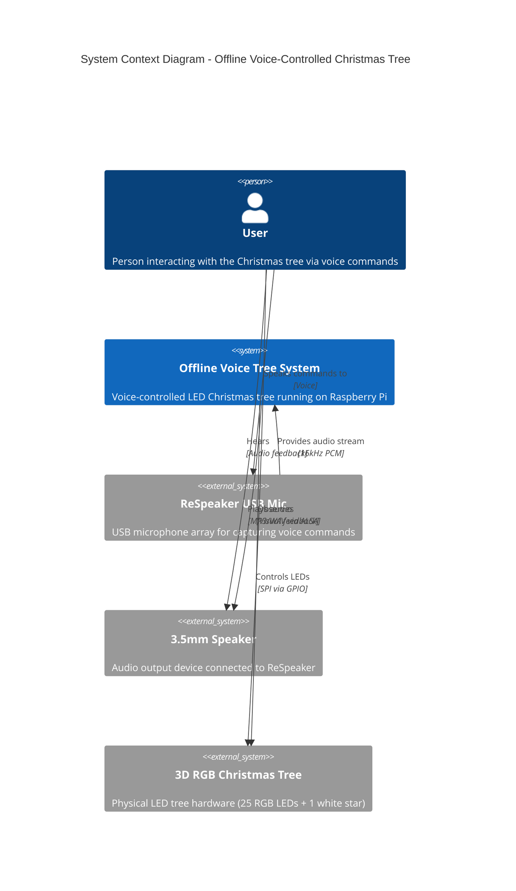

### Key System Characteristics

- **Fully Offline**: No network connectivity required
- **Real-time Processing**: Voice commands processed locally with minimal latency
- **Multi-threaded**: Concurrent voice recognition, LED control, and audio playback
- **Standalone Operation**: Can run on boot without external dependencies
- **Low Resource**: Designed for Raspberry Pi 4/5 hardware constraints

### External Actors

| Actor | Type | Description |
|-------|------|-------------|
| User | Person | Provides voice commands to control the tree |
| ReSpeaker USB Mic | Hardware | 4-microphone array for audio capture |
| 3.5mm Speaker | Hardware | Passive speaker for audio output |
| 3D RGB Christmas Tree | Hardware | 25 RGB LEDs + 1 white star controlled via GPIO |

---

## Level 2: Container Diagram

### Overview

The system consists of a single Python application with three concurrent thread containers that communicate via shared state. External dependencies include Vosk models, audio files, and system libraries.

### Container Diagram

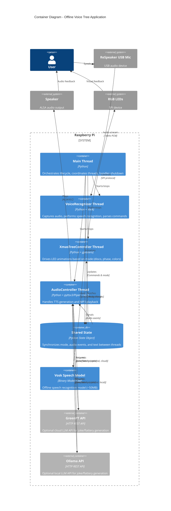

### Container Responsibilities

| Container | Technology | Responsibilities |
|-----------|-----------|-----------------|
| Main Thread | Python 3 | System initialization, thread lifecycle management, graceful shutdown |
| VoiceRecognizer Thread | Python + Vosk + sounddevice | Audio capture, speech recognition, command parsing, state updates |
| XmasTreeController Thread | Python + gpiozero + colorzero | LED animation control, mode transitions, color management |
| AudioController Thread | Python + pyttsx3/Piper + python-vlc | Text-to-speech synthesis (pyttsx3 or Piper TTS), MP3 playback, temporary WAV generation, GreenPT API integration |
| Shared State | Python State class | Thread-safe communication, mode storage, event signaling |
| Vosk Model | Binary files | Offline speech recognition grammar and vocabulary |

---

## Level 3: Component Diagram

### Overview

This level breaks down each thread container into its constituent components, showing their responsibilities and interactions.

### Component Diagram

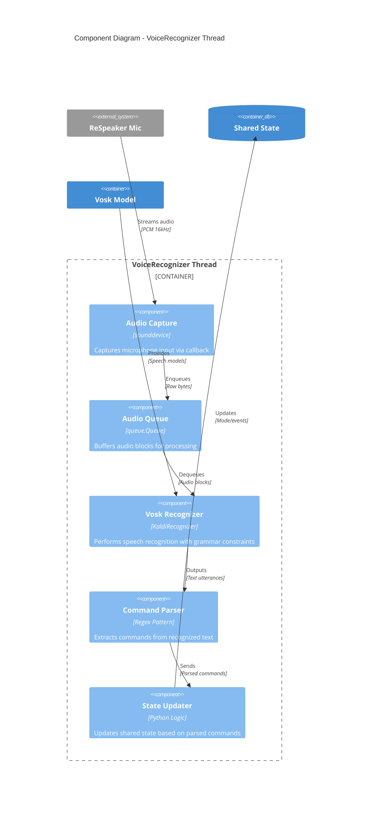

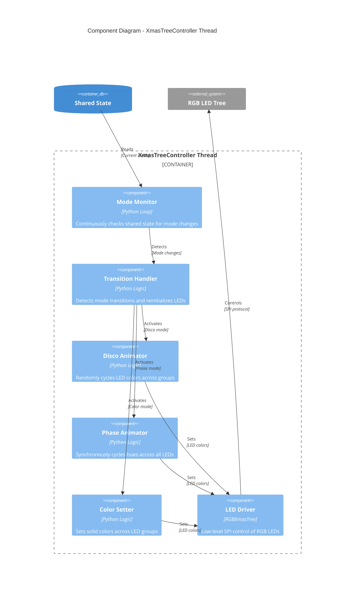

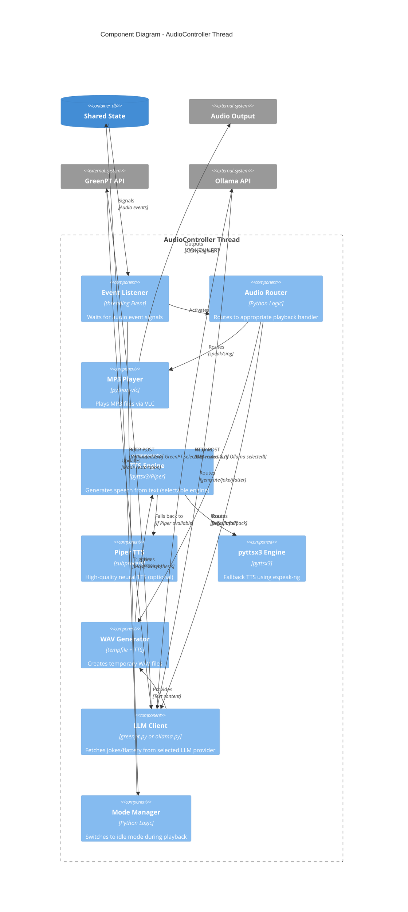

### Component Interactions

#### VoiceRecognizer Components

| Component | Inputs | Outputs | Key Logic |
|-----------|--------|---------|-----------|
| Audio Capture | Microphone stream | Raw audio bytes | Callback function invoked by sounddevice |
| Audio Queue | Raw audio bytes | Buffered blocks | Thread-safe FIFO queue |
| Vosk Recognizer | Audio blocks, grammar | JSON results | AcceptWaveform() returns final/partial results |
| Command Parser | Text utterances | Command + args | Regex: `christmas tree\s+(\w+)(?:\s+(.*))?` |
| State Updater | Parsed commands | State mutations | Maps commands to mode changes or audio events |

#### XmasTreeController Components

| Component | Inputs | Outputs | Key Logic |
|-----------|--------|---------|-----------|
| Mode Monitor | Shared state | Current mode | Polls state.mode every 50ms |
| Transition Handler | Mode changes | LED initialization | Detects mode != current_mode, reinitializes colors |
| Disco Animator | Timer | LED colors | Adds Hue(deg=10) to each LED group randomly |
| Phase Animator | Timer | LED colors | Synchronously adds Hue(deg=10) to all LEDs |
| Sparkle Animator | Timer | LED colors | Randomly assigns LEDs to bright, dim, or off states (25% bright, 25% dim, 50% off) |
| GB Flag Pattern | Static | LED colors | Displays Union Jack approximation with red/white/blue pattern |
| Color Setter | Mode string | LED colors | Converts color name to Color object |
| LED Driver | RGB values | SPI data | Formats as [brightness, B, G, R] with start/end frames |

#### AudioController Components

| Component | Inputs | Outputs | Key Logic |
|-----------|--------|---------|-----------|
| Event Listener | audio_event | Wakeup signal | Blocks on threading.Event with 0.5s timeout |
| Audio Router | audio_type | Handler selection | Routes based on "speak", "sing", "generate", "joke", or "flatter" |
| MP3 Player | File path | Audio stream | VLC instance with ALSA plughw:X,0 device |
| TTS Engine | Text string | Spoken audio | Selects Piper TTS or pyttsx3 based on availability/preference |
| Piper TTS | Text string | WAV file | High-quality neural TTS via subprocess |
| pyttsx3 Engine | Text string | Spoken audio | espeak-ng backend with English voice selection |
| LLM Client | Command type | Generated text | Fetches jokes/flattery from GreenPT (cloud) or Ollama (local) with session-based repetition avoidance |
| WAV Generator | Text string | Temporary file | TTS generation + play_mp3() + cleanup |
| Mode Manager | Playback start/end | Mode changes | Sets sparkle mode for jokes, idle mode for other audio; restores last_mode after playback |

---

## Level 4: Code Level

### Overview

This level provides detailed implementation insights, including class structures, key methods, and critical code patterns.

### Class Diagram

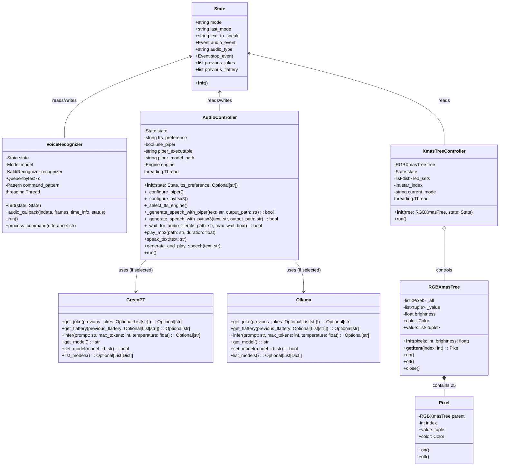

### Key Classes and Methods

#### State Class (offline_voice_tree.py:129-148)

```python
class State:
    """A simple container for mutable state shared between threads."""

    def __init__(self):
        self.mode = "disco"           # Current lighting mode
        self.last_mode = "disco"      # Previous mode (for restoration)
        self.text_to_speak = ""       # Text for TTS generation
        self.audio_event = threading.Event()  # Audio trigger signal
        self.audio_type = None        # "speak", "generate", "sing", "joke", or "flatter"
        self.stop_event = threading.Event()   # Graceful shutdown signal
        self.previous_jokes = []      # Track jokes to avoid repetition
        self.previous_flattery = []   # Track flattery to avoid repetition
```

**Purpose**: Provides thread-safe shared state using Python's GIL. Events provide signaling mechanism without polling.

**Thread Safety**: All reads/writes are atomic Python operations. Events use internal locks.

#### VoiceRecognizer Thread (offline_voice_tree.py:416-520)

**Key Methods**:

1. **`__init__(state: State)`** (lines 419-445)
   - Loads Vosk model from `MODEL_PATH`
   - Creates `KaldiRecognizer` with grammar constraints
   - Initializes audio queue and command regex pattern

2. **`audio_callback(indata, frames, time_info, status)`** (lines 446-450)
   - Callback invoked by sounddevice for each audio block
   - Converts numpy array to bytes and enqueues

3. **`run()`** (lines 452-479)
   - Opens `RawInputStream` with 16kHz sample rate
   - Dequeues audio blocks with 0.1s timeout
   - Calls `AcceptWaveform()` for recognition
   - Parses JSON results and calls `process_command()`

4. **`process_command(utterance: str)`** (lines 481-519)
   - Matches utterance against regex: `christmas tree\s+(\w+)(?:\s+(.*))?`
   - Updates `state.mode` for color/disco/phase/gb commands
   - Sets `state.audio_type` and signals `audio_event` for speak/sing/generate/joke/flatter

**Grammar Constraints** (line 435-436):
```python
grammar_phrases = [f"christmas tree {cmd}" for cmd in SUPPORTED_COLOURS + SUPPORTED_COMMANDS]
self.recognizer = KaldiRecognizer(self.model, 16000, json.dumps(grammar_phrases))
```
This limits vocabulary to improve recognition accuracy.

#### XmasTreeController Thread (offline_voice_tree.py:157-278)

**Key Methods**:

1. **`__init__(tree: RGBXmasTree, state: State)`** (lines 160-175)
   - Precomputes LED groups: `[range(25)[::3], range(25)[1::3], range(25)[2::3]]`
   - Sets star index to 3 (GPIO pin for top white LED)

2. **`run()`** (lines 177-277)
   - Initializes LED colors based on starting mode
   - Main loop checks `state.mode` every 50ms
   - Detects mode transitions and reinitializes colors
   - Applies animation logic based on current mode:
     - **Disco**: Adds `Hue(deg=10)` to each LED group
     - **Phase**: Synchronously adds `Hue(deg=10)` to all LEDs
     - **Sparkle**: Randomly assigns LEDs to bright (25%), dim (25%), or off (50%) states with twinkling star
     - **Geebee**: Displays static Union Jack flag pattern (red/white/blue approximation)
     - **Color**: Sets solid `Color(mode)` across all LEDs
     - **Idle**: Turns off all LEDs (black)

**Mode Transition Logic** (lines 213-237):
```python
if mode != self.current_mode:
    if mode == "disco":
        colours = [Color('red'), Color('green'), Color('blue')]
        for i, leds in enumerate(self.led_sets):
            for led in leds:
                self.tree[led].color = colours[i]
    # ... (similar for phase, colors, idle)
    self.current_mode = mode
```
This ensures clear visual feedback when mode changes.

#### AudioController Thread (offline_voice_tree.py:284-410)

**Key Methods**:

1. **`__init__(state: State, tts_preference: Optional[str])`** (lines 319-309)
   - Configures Piper TTS if available (finds executable and model path)
   - Initializes pyttsx3 TTS engine (espeak-ng backend) with English voice selection
   - Selects TTS engine based on preference and availability
   - Preference: "piper", "pyttsx3", or None (auto-detect)

2. **`play_mp3(path: str, duration: float)`** (lines 297-349)
   - Creates VLC instance with ALSA output to `plughw:X,0`
   - Uses detected ReSpeaker ALSA card number
   - Sets volume to 50%
   - Plays for specified duration or until completion

**ALSA Device Selection** (lines 322-324):
```python
alsa_device = f'plughw:{respeaker_alsa_card},0' if respeaker_alsa_card else 'plughw:2,0'
instance = vlc.Instance('--aout=alsa', f'--alsa-audio-device={alsa_device}', '--intf=dummy')
```
The `plughw` plugin provides automatic sample rate conversion and channel mapping.

3. **`generate_and_play_speech(text: str)`** (lines 622-667)
   - Creates temporary WAV file using `tempfile.NamedTemporaryFile`
   - Calls `_generate_speech_with_piper()` or `_generate_speech_with_pyttsx3()` based on selection
   - Falls back to pyttsx3 if Piper fails
   - Waits for file to be ready using `_wait_for_audio_file()`
   - Plays via `play_mp3()` (VLC handles WAV format)
   - Cleans up temporary file

4. **`run()`** (lines 670-713)
   - Waits on `audio_event` with 0.5s timeout
   - Switches mode based on audio type:
     - **Joke**: Sets `state.mode = "sparkle"` (twinkling LED effect)
     - **Other audio**: Sets `state.mode = "idle"` (LEDs off)
   - Routes based on `audio_type` ("speak", "sing", "generate", "joke", "flatter")
   - For "joke": Calls `get_joke(previous_jokes=state.previous_jokes)`, tracks response, overridable via `JOKE_TEXT` env var
   - For "flatter": Calls `get_flattery(previous_flattery=state.previous_flattery)`, tracks response
   - Restores previous mode: `state.mode = state.last_mode`
   - Clears event and resets audio_type

#### RGBXmasTree Hardware Driver (tree.py:104-169)

**Key Methods**:

1. **`__init__(pixels=25, brightness=0.5, mosi_pin=12, clock_pin=25)`**
   - Inherits from `SPIDevice` (gpiozero SPI abstraction)
   - Creates 25 `Pixel` objects with parent reference
   - Initializes SPI communication for APA102 LEDs

2. **`value` property** (lines 148-159)
   - Formats data as: `[0]*4 + [brightness, B, G, R]*25 + [0]*5`
   - Brightness encoded as `0b11100000 | self._brightness_bits` (5-bit range)
   - Transfers via SPI to update all LEDs atomically

3. **`color` property** (lines 128-131)
   - Sets all LEDs to same color simultaneously
   - Used for solid color modes

**LED Indexing**: Each LED is a `Pixel` object accessed via `tree[index]`. The star is at index 3.

### Critical Code Patterns

#### Thread Coordination Pattern

```python
# Producer thread (VoiceRecognizer)
self.state.audio_type = "speak"
self.state.audio_event.set()

# Consumer thread (AudioController)
if self.state.audio_event.wait(timeout=0.5):
    # Process audio
    self.state.audio_event.clear()
```

**Why**: Avoids busy-waiting and provides timeout for checking `stop_event`.

#### Graceful Shutdown Pattern

```python
# Main thread
try:
    while True:
        time.sleep(1)
except KeyboardInterrupt:
    STATE.stop_event.set()
    led_thread.join(timeout=1.0)
    # ...
finally:
    tree.close()

# Worker threads
while not self.state.stop_event.is_set():
    # Work with timeouts
    data = self.q.get(timeout=0.1)
```

**Why**: Prevents GPIO/resource leaks on CTRL-C.

#### Device Auto-Detection Pattern (offline_voice_tree.py:47-70)

```python
devices = sd.query_devices()
respeaker_index = None
respeaker_alsa_card = None
for idx, dev in enumerate(devices):
    if dev['max_input_channels'] > 0 and 'respeaker' in dev['name'].lower():
        respeaker_index = idx
        match = re.search(r'hw:(\d+),0', dev['name'])
        if match:
            respeaker_alsa_card = match.group(1)
        break

if respeaker_index is None:
    sd.default.device = (None, None)  # Fallback
else:
    sd.default.device = (respeaker_index, None)
```

**Why**: Enables plug-and-play operation across different Raspberry Pi configurations.

---

## Key Design Decisions

### 1. Thread-Based Concurrency vs. Async/Await

**Decision**: Use threading.Thread with shared State object

**Rationale**:
- Vosk and sounddevice use callback-based APIs incompatible with asyncio
- GPIO/SPI operations (gpiozero) are synchronous
- Python GIL provides sufficient thread safety for simple state mutations
- Simpler debugging and stack traces compared to coroutines

**Trade-offs**:
- Higher memory overhead (~8MB per thread)
- Potential GIL contention (mitigated by I/O-bound workloads)

### 2. Vosk Grammar Constraints

**Decision**: Limit vocabulary to predefined grammar phrases

**Rationale**:
- Improves recognition accuracy by constraining search space
- Reduces false positives from ambient noise
- Enables operation with smaller models (~50MB vs. 1GB+)

**Implementation** (offline_voice_tree.py:435-436):
```python
grammar_phrases = [f"christmas tree {cmd}" for cmd in SUPPORTED_COLOURS + SUPPORTED_COMMANDS]
self.recognizer = KaldiRecognizer(self.model, 16000, json.dumps(grammar_phrases))
```

**Trade-off**: Cannot recognize arbitrary text after "generate" command (uses `DEFAULT_GENERATE_TEXT` instead).

### 3. VLC for Audio Playback vs. PyAudio

**Decision**: Use python-vlc with ALSA plughw device

**Rationale**:
- VLC handles MP3/WAV decoding natively (PyAudio requires additional libraries)
- ALSA `plughw` plugin provides automatic sample rate conversion
- ReSpeaker DAC has limited native format support (fails with raw `hw:X,0`)
- VLC's volume control is straightforward

**Implementation** (offline_voice_tree.py:322-330):
```python
alsa_device = f'plughw:{respeaker_alsa_card},0' if respeaker_alsa_card else 'plughw:2,0'
instance = vlc.Instance('--aout=alsa', f'--alsa-audio-device={alsa_device}', '--intf=dummy')
player.audio_set_volume(50)
```

### 4. LED Mode Transitions with Reinitialization

**Decision**: Reset LED colors when entering disco/phase modes

**Rationale**:
- Provides clear visual feedback that mode changed
- Without reset, hue cycling continues from previous colors (appears stuck)
- Disco mode starts with distinct red/green/blue groups

**Implementation** (offline_voice_tree.py:213-219):
```python
if mode != self.current_mode:
    if mode == "disco":
        colours = [Color('red'), Color('green'), Color('blue')]
        for i, leds in enumerate(self.led_sets):
            for led in leds:
                self.tree[led].color = colours[i]
```

### 5. Visual Modes During Audio Playback

**Decision**: Use sparkle mode for jokes, idle mode for other audio

**Rationale**:
- Sparkle effect adds visual excitement to joke delivery
- Idle mode (LEDs off) focuses attention on other audio content
- Reduces visual distraction during TTS
- Restores previous mode after playback completes

**Implementation** (offline_voice_tree.py:867-870):
```python
self.state.last_mode = self.state.mode
if self.state.audio_type == "joke":
    self.state.mode = "sparkle"  # Twinkling LEDs for jokes
else:
    self.state.mode = "idle"     # LEDs off for other audio
# ... play audio ...
self.state.mode = self.state.last_mode
```

### 6. GreenPT API Integration for Dynamic Content

**Decision**: Integrate optional GreenPT LLM API via `greenpt.py` module for joke and flattery commands with session-based repetition avoidance

**Rationale**:
- Provides dynamic, entertaining content without pre-recorded files
- Adds personality and variety to the tree's interactions
- LLM-generated content is family-appropriate and contextual
- Session tracking ensures no repeated jokes/flattery during a session
- Graceful degradation if API unavailable (prints error, continues operation)
- Modular design: `greenpt.py` handles all API interactions

**Implementation** (`greenpt.py`):
- `get_joke(previous_jokes: Optional[List[str]])`: Fetches joke, includes previous jokes in prompt to avoid repetition
- `get_flattery(previous_flattery: Optional[List[str]])`: Fetches flattery, includes previous flattery in prompt
- `infer()`: Core API interaction with configurable model, temperature, and max_tokens
- Model persistence: Selected model stored in `selected_model.txt` for consistency
- Automatic `.env` loading: Reads `local.env` file if present

**Session Tracking** (`offline_voice_tree.py`):
- `State.previous_jokes`: List of jokes told during session (max 10)
- `State.previous_flattery`: List of flattery given during session (max 10)
- Each new joke/flattery appended to list and passed to API in prompt
- Prevents repetition by explicitly listing previous content in API request

**Commands**:
- `christmas tree joke`: Requests family-friendly festive joke, speaks via TTS, tracks in session
- `christmas tree flatter`: Generates over-the-top humorous praise, speaks via TTS, tracks in session

**Configuration**:
- `GREENPT_API_BASE_URL`: API endpoint (default: `https://api.greenpt.ai/v1`)
- `GREENPT_API_KEY`: Required authentication key (from env or `local.env`)
- `GREENPT_MODEL_ID`: Model selection (default: `gemma-3-27b-it`)

**Error Handling**:
- Missing API key → Warning printed, command skipped
- Network timeout (30s) → Error logged, operation continues
- API failure → Error logged, LEDs restore to previous mode
- Invalid JSON response → Helpful error message with response preview

**Trade-offs**:
- Requires internet connectivity (unlike core offline functionality)
- Adds ~10-15s latency for API call + TTS generation
- Introduces external dependency (can be disabled via missing API key)
- Session tracking uses memory (limited to last 10 entries per type)

### 7. Dual LLM Provider Support (GreenPT and Ollama)

**Decision**: Support both GreenPT (cloud) and Ollama (local) LLM providers with runtime selection via command-line parameter

**Rationale**:
- Provides flexibility between cloud-based and fully local LLM inference
- Ollama enables offline operation with local models (no internet required for AI features)
- GreenPT offers access to larger, more capable models via API
- Identical interface (get_joke, get_flattery, infer) allows seamless switching
- User can choose based on privacy needs, cost, and connectivity

**Implementation** (`offline_voice_tree.py:main()`):
- `--llm-provider` command-line argument with choices `['greenpt', 'ollama']`
- Dynamic import of selected module at runtime
- Both modules (`greenpt.py` and `ollama.py`) implement identical API
- Model persistence: Each provider stores selected model separately
- Default: GreenPT for backward compatibility

**Command-Line Interface**:
- `--llm-provider greenpt`: Use GreenPT cloud API (default)
- `--llm-provider ollama`: Use local Ollama server

**Configuration**:
- **Ollama**: `OLLAMA_API_BASE_URL` (default: `http://localhost:11434`), `OLLAMA_MODEL_ID` (default: `llama3.2:3b`)
- **GreenPT**: `GREENPT_API_BASE_URL`, `GREENPT_API_KEY`, `GREENPT_MODEL_ID`

**Module Implementations**:
- `ollama.py`: Local Ollama API client (HTTP requests to local server)
- `greenpt.py`: Cloud GreenPT API client (HTTP requests with authentication)
- Both support: `list_models()`, `get_model()`, `set_model()`, `infer()`, `get_joke()`, `get_flattery()`
- Session-based repetition avoidance implemented in both

**Error Handling**:
- Ollama not running → Connection error, operation skipped
- GreenPT missing API key → Warning printed, operation skipped
- Network timeout → Error logged, LEDs restore to previous mode

**Trade-offs**:
- Ollama requires running local server (`ollama serve`) and model downloads (2-8GB per model)
- GreenPT requires internet connectivity and API key (may incur costs)
- Ollama inference may be slower on Raspberry Pi (depending on model size)
- Both require session tracking memory (limited to last 10 entries)

### 8. Piper TTS Integration for High-Quality Speech

**Decision**: Support optional Piper TTS alongside pyttsx3 for improved speech quality

**Rationale**:
- Piper TTS provides neural TTS with significantly better quality than espeak-ng
- pyttsx3 can produce muffled or corrupted audio, especially with longer texts
- User-selectable via command-line argument for flexibility
- Automatic fallback to pyttsx3 if Piper unavailable

**Implementation** (`offline_voice_tree.py:AudioController`):
- `_configure_piper()`: Searches common locations for Piper executable, reads model path from `PIPER_MODEL_PATH`
- `_configure_pyttsx3()`: Initializes pyttsx3 with English voice selection (prioritizes mbrola voices)
- `_select_tts_engine()`: Determines engine based on user preference and availability
- `_generate_speech_with_piper()`: Generates WAV via subprocess call to Piper CLI
- `_generate_speech_with_pyttsx3()`: Generates WAV via pyttsx3 `save_to_file()`

**Command-Line Interface**:
- `--tts-engine auto`: Auto-detect (prefers Piper if available, default)
- `--tts-engine piper`: Force Piper TTS (warns if unavailable)
- `--tts-engine pyttsx3`: Force pyttsx3

**Configuration**:
- `PIPER_MODEL_PATH`: Path to Piper model `.onnx` file (required for Piper)
- Piper executable: Auto-detected from PATH or common locations

**Trade-offs**:
- Piper requires additional setup (executable + model download, ~40-90MB)
- Better quality but larger resource footprint
- pyttsx3 always available as fallback

### 9. GB Flag Pattern and Sparkle Mode

**Decision**: Add "geebee" (GB) mode for displaying Union Jack flag pattern and "sparkle" mode for twinkling LED effect

**Rationale**:
- GB flag pattern provides patriotic/festive display option
- Static flag pattern is simple 5x5 grid approximation of Union Jack
- Sparkle mode adds dynamic visual interest during joke playback
- Both modes integrate seamlessly with existing mode transition logic

**Implementation**:

**GB Flag Pattern** (offline_voice_tree.py:270-283, 324-335, 387-399):
- Triggered by "christmas tree gb" voice command
- 5x5 LED grid displays red/white/blue pattern approximating Union Jack
- Center horizontal line is red (St. George's Cross)
- Diagonals and background suggest saltires and field colors
- Static display (no animation)

**Sparkle Mode** (offline_voice_tree.py:264-269, 318-323, 364-386):
- Automatically triggered during joke playback
- Dynamically assigns each LED per frame:
  - 25% probability: bright color (red/green/blue/yellow/orange/purple/white/pink)
  - 25% probability: dim color (darkred/darkgreen/darkblue/darkorange/darkviolet)
  - 50% probability: off (black)
- Star LED tinkles between white (70%) and gray (30%)
- Creates twinkling/sparkling visual effect synchronized with joke audio

**Commands**:
- `christmas tree gb`: Display GB flag pattern
- Sparkle mode: Automatic during joke playback (not directly commandable)

**Trade-offs**:
- GB flag approximation limited by 5x5 LED grid resolution
- Sparkle mode not user-commandable (only triggered by joke command)
- Both modes add minimal code complexity (~50 lines total)

---

## Threading Model

### Thread Lifecycle

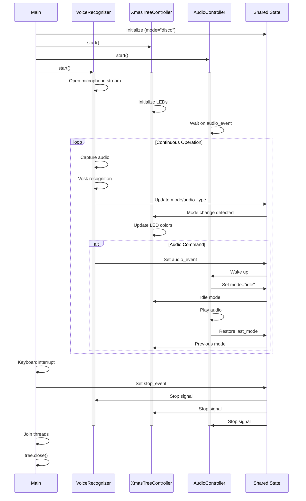

### Thread Communication Matrix

| From → To | Mechanism | Data | Frequency |
|-----------|-----------|------|-----------|
| VoiceRecognizer → Shared State | Direct write | mode, audio_type, text_to_speak | On command |
| VoiceRecognizer → AudioController | Event signal | audio_event.set() | On speak/sing/generate |
| Shared State → XmasTreeController | Polling | state.mode | Every 50ms |
| Shared State → AudioController | Event wait | audio_event.wait() | Blocking with timeout |
| AudioController → Shared State | Direct write | mode (idle/restore) | On audio start/end |
| Main → All Threads | Event signal | stop_event.set() | On shutdown |

### Synchronization Primitives

1. **threading.Event** (audio_event, stop_event)
   - Provides one-to-one signaling
   - `wait(timeout)` allows periodic checks
   - `set()` wakes waiting thread
   - `clear()` resets event

2. **queue.Queue** (audio queue)
   - Thread-safe FIFO for audio blocks
   - `get(timeout)` allows checking stop_event
   - Bounded by memory only

3. **Python GIL** (Global Interpreter Lock)
   - Ensures atomic reads/writes of simple types (str, int)
   - No explicit locks needed for state.mode updates
   - I/O operations (audio, GPIO, sleep) release GIL

---

## State Management

### State Object Structure

```python
STATE = State()  # Global instance

class State:
    mode: str           # "disco" | "phase" | "sparkle" | "geebee" | color_name | "idle"
    last_mode: str      # Previous mode before audio playback
    text_to_speak: str  # Text for generate command
    audio_event: threading.Event  # Audio trigger
    audio_type: str     # "speak" | "generate" | "sing" | "joke" | "flatter" | None
    stop_event: threading.Event   # Shutdown signal
    previous_jokes: List[str]     # Jokes told during session (max 10)
    previous_flattery: List[str]  # Flattery given during session (max 10)
```

### State Transitions

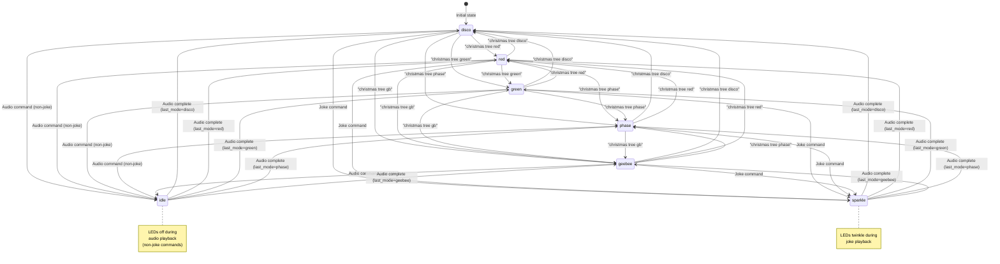

### State Mutation Rules

1. **VoiceRecognizer** can write:
   - `mode` (color/disco/phase)
   - `audio_type` ("speak", "generate", "sing")
   - `text_to_speak`
   - Signal `audio_event`

2. **AudioController** can write:
   - `mode` (only to "idle" or `last_mode`)
   - `last_mode` (backup before idle)
   - Clear `audio_event`

3. **XmasTreeController** only reads:
   - `mode` (polling)

4. **All threads** check:
   - `stop_event` (read-only)

### Thread Safety Analysis

**Safe without locks**:
- `mode` (str) - atomic reference assignment
- `audio_type` (str) - atomic reference assignment
- `text_to_speak` (str) - atomic reference assignment
- `audio_event` / `stop_event` - internally locked

**Potential race conditions** (none critical):
- Read-modify-write of `last_mode` (only AudioController writes)
- Multiple commands in rapid succession (last one wins, acceptable)

---

## Data Flow

### Voice Command Flow

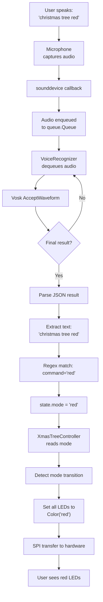

### Audio Playback Flow

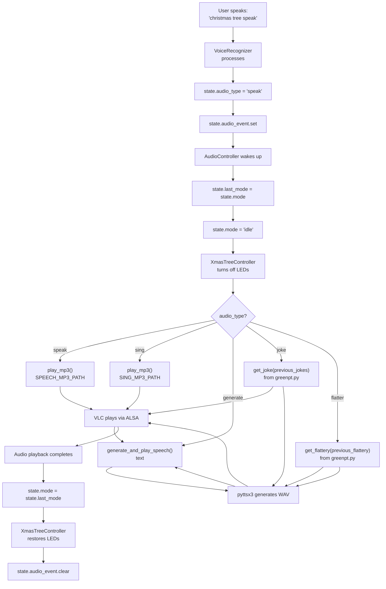

### LED Animation Flow (Disco Mode)

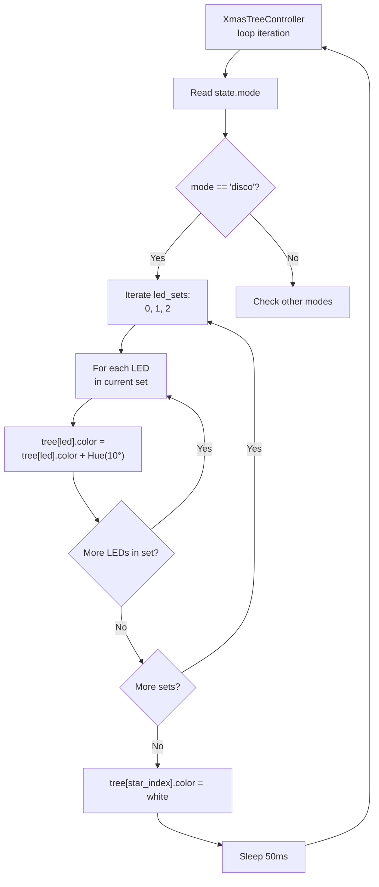

---

## Configuration

### Environment Variables

| Variable | Default | Purpose |
|----------|---------|---------|
| `VOSK_MODEL_PATH` | `./model` | Path to Vosk speech recognition model directory |
| `VOSK_MODEL_NAME` | (auto-detected) | Optional override for displayed model name in startup summary |
| `PIPER_EXECUTABLE_PATH` | (auto-detected) | Optional explicit path to Piper TTS executable |
| `PIPER_MODEL_PATH` | (required for Piper) | Path to Piper TTS .onnx model file |
| `GREENPT_API_BASE_URL` | `https://api.greenpt.ai/v1` | Base URL for GreenPT API (cloud LLM provider) |
| `GREENPT_API_KEY` | `""` (empty) | Authentication key for GreenPT API (required for joke/flatter commands with GreenPT) |
| `GREENPT_MODEL_ID` | `gemma-3-27b-it` | Model ID to use for GreenPT API requests |
| `OLLAMA_API_BASE_URL` | `http://localhost:11434` | Base URL for Ollama API (local LLM provider) |
| `OLLAMA_MODEL_ID` | `llama3.2:3b` | Model ID to use for Ollama API requests |
| `VLC_VOLUME` | `75` | VLC audio playback volume percentage (0-100) |
| `JOKE_TEXT` | (none) | Optional hardcoded joke text for testing (overrides API calls) |

### Constants (offline_voice_tree.py:91-124)

| Constant | Value | Description |
|----------|-------|-------------|
| `MODEL_PATH` | `$VOSK_MODEL_PATH` or `./model` | Vosk model directory |
| `SUPPORTED_COLOURS` | `["red", "green", "blue", ...]` | 10 recognized colors |
| `SUPPORTED_COMMANDS` | `["disco", "phase", "speak", "generate", "sing", "joke", "flatter", "gb"]` | Non-color commands |
| TTS engine selection | Command-line `--tts-engine` argument | "auto", "piper", or "pyttsx3" |
| LLM provider selection | Command-line `--llm-provider` argument | "greenpt" (default) or "ollama" |
| `DEFAULT_SPEECH_DURATION` | `10` | Seconds to play speech.mp3 |
| `SPEECH_MP3_PATH` | `./speech.mp3` | Audio file for "speak" command |
| `SING_MP3_PATH` | `./08-I-Wish-it-Could-be-Christmas-Everyday.mp3` | Song for "sing" command |
| `DEFAULT_GENERATE_TEXT` | `"Hello everyone, this is your Christmas tree talking"` | TTS text for "generate" |
| `GREENPT_API_BASE_URL` | `$GREENPT_API_BASE_URL` or `https://api.greenpt.example.com/v1` | GreenPT API endpoint |
| `GREENPT_API_KEY` | `$GREENPT_API_KEY` or `""` | GreenPT API authentication key |
| `GREENPT_MODEL_ID` | `$GREENPT_MODEL_ID` or `gemma-3-27b-it` | GreenPT model to use |

### Hardware Configuration

| Setting | Value | Notes |
|---------|-------|-------|
| Sample rate | 16000 Hz | Fixed for Vosk compatibility |
| Audio blocksize | 8000 samples | 0.5 second blocks |
| SPI pins | MOSI=12, CLK=25 | Default for RGBXmasTree |
| LED count | 25 RGB + 1 white | 3D Christmas tree hardware |
| Brightness | 0.1 (10%) | Adjustable in main() |
| TTS rate | espeak rate - 25 | Slower for clarity |
| Audio volume | 75% (default) | VLC volume setting (configurable via VLC_VOLUME env var) |

---

## Dependencies

### Python Package Dependencies

```
Core Dependencies:
├── vosk (0.3.45+)           # Offline speech recognition
├── sounddevice (0.4.6+)     # Audio capture
├── pyttsx3 (2.90+)          # Text-to-speech (espeak-ng backend)
├── python-vlc (3.0.20123+)  # Audio playback
├── requests (2.31.0+)       # HTTP client for GreenPT API
├── python-dotenv (optional) # Environment variable loading for greenpt.py
├── gpiozero (2.0+)          # GPIO/SPI control
└── colorzero (2.0+)         # Color manipulation

System Libraries:
├── espeak-ng                # TTS engine backend
├── portaudio19-dev          # Audio I/O
├── vlc                      # Media player
└── python3-lgpio            # GPIO access (RPi 5)
```

### External Models

**Vosk Speech Model** (required):
- Recommended: `vosk-model-small-en-us-0.15` (~50MB)
- Download: https://alphacephei.com/vosk/models
- Larger models available for better accuracy (up to 1.8GB)

**Piper TTS Model** (optional, for high-quality TTS):
- Recommended: `en_US-lessac-medium.onnx` (~40MB) or `en_US-lessac-high.onnx` (~90MB)
- Download: https://huggingface.co/rhasspy/piper-voices
- See [INSTALL_PIPER.md](INSTALL_PIPER.md) for installation instructions

### Hardware Dependencies

1. **ReSpeaker 4-Mic Array** (USB)
   - Provides: Microphone input + audio DAC output
   - ALSA device: Auto-detected as `plughw:X,0`

2. **3D RGB Christmas Tree**
   - Interface: SPI (MOSI=GPIO12, CLK=GPIO25)
   - LEDs: 25x APA102 RGB + 1x white star
   - Driver: tree.py (RGBXmasTree class)

3. **Raspberry Pi 4/5**
   - OS: Raspberry Pi OS (Debian-based)
   - Python: 3.9+ (system Python)
   - Memory: 2GB+ recommended

---

## Deployment Architecture

### Runtime Environment

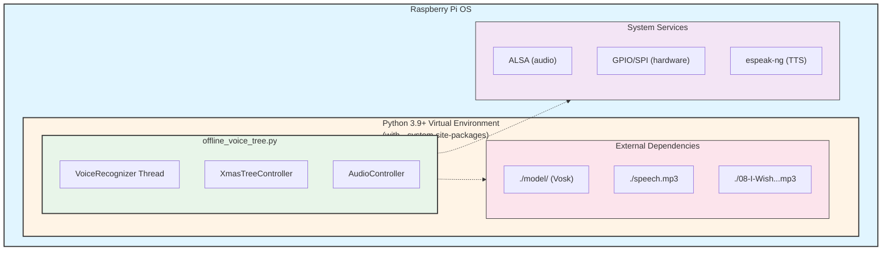

### Startup Sequence (Systemd/rc.local)

```bash
#!/bin/bash
# /etc/rc.local or systemd unit

# Activate virtual environment
source /home/pi/.virtualenvs/xmastree/bin/activate

# Run application
python /home/pi/Desktop/CODE/raspberrypi-xmastree/offline_voice_tree.py
```

---

## Performance Characteristics

### Latency Analysis

| Stage | Typical Latency | Notes |
|-------|----------------|-------|
| Audio capture | 0.5s | Blocksize of 8000 samples @ 16kHz |
| Vosk recognition | 0.1-0.5s | Per utterance, depends on complexity |
| Command parsing | <1ms | Simple regex match |
| State update | <1ms | Atomic assignment |
| LED update | 50ms | XmasTreeController loop iteration |
| **Total (voice→LEDs)** | **0.6-1.1s** | Acceptable for user interaction |

### Resource Usage

| Resource | Idle | Active Recognition | Audio Playback |
|----------|------|-------------------|----------------|
| CPU | 5-10% | 30-50% | 15-25% |
| Memory | 180MB | 200MB | 210MB |
| GPU | 0% | 0% | 0% |
| Network | 0 KB/s | 0 KB/s | 0 KB/s |

**Model Size**: Vosk model occupies ~50MB RAM (loaded once at startup).

### Scalability Considerations

**Current Design**:
- Single-threaded speech recognition (Vosk limitation)
- No queuing of commands (last command wins)
- Fixed LED count (25 + star)

**Potential Improvements**:
- Command queue for buffering rapid commands
- Multiple Vosk recognizers for parallel processing
- Dynamic LED count support

---

## Error Handling

### Exception Handling Strategy

1. **VoiceRecognizer Thread**:
   - Audio device not found → Falls back to default device
   - Vosk model missing → Raises RuntimeError with helpful message
   - Queue timeout → Allows checking stop_event (graceful)

2. **XmasTreeController Thread**:
   - GPIO errors (AttributeError, RuntimeError) → Breaks loop cleanly
   - Catches NoneType errors from closed GPIO pins

3. **AudioController Thread**:
   - File not found → Prints warning, skips playback
   - VLC errors → Logged, continues operation
   - TTS errors → Logged, continues operation

### Graceful Degradation

- Missing ReSpeaker → Uses default microphone
- Missing MP3 files → Skips audio playback, LEDs continue
- Invalid commands → Logged, ignored

---

## Future Enhancements

### Potential Improvements

1. **Extended Grammar**:
   - Allow capturing arbitrary text after "generate" command
   - Requires larger Vosk model or different recognition approach

2. **State Persistence**:
   - Save last mode to file, restore on restart
   - Allows resuming previous lighting pattern

3. **Web Interface**:
   - Flask/FastAPI server for remote control
   - WebSocket for real-time status updates

4. **Multiple Tree Support**:
   - Control multiple trees simultaneously
   - Synchronize animations across network

5. **Advanced Animations**:
   - Wave patterns, sparkle effects
   - Music-reactive lighting (audio FFT analysis)

---

## References

### External Documentation

- **C4 Model**: https://c4model.com/
- **Vosk Speech Recognition**: https://alphacephei.com/vosk/
- **gpiozero Documentation**: https://gpiozero.readthedocs.io/
- **pyttsx3 Documentation**: https://pyttsx3.readthedocs.io/
- **APA102 LED Protocol**: https://cpldcpu.wordpress.com/2014/11/30/understanding-the-apa102-superled/

### Source Files

- `offline_voice_tree.py` (lines 1-1027): Main application
- `greenpt.py` (lines 1-590): GreenPT API client module with model management
- `ollama.py` (lines 1-590): Ollama API client module with model management
- `tree.py` (lines 1-174): Hardware driver
- `README.md`: Installation and usage guide
- `INSTALL_PIPER.md`: Piper TTS installation instructions

---

**Document Version**: 2.1
**Last Updated**: 2025-01-XX
**Author**: Generated by Claude Code
**License**: See project LICENSE

**Recent Updates**:
- Added Ollama integration for local LLM inference alongside GreenPT (cloud LLM)
- New `--llm-provider` command-line argument to switch between GreenPT and Ollama
- Created `ollama.py` module with identical interface to `greenpt.py`
- Added Piper TTS support with command-line selection (`--tts-engine`)
- Integrated `greenpt.py` module for AI-powered content generation
- Added session-based repetition avoidance for jokes and flattery
- Updated State class with `previous_jokes` and `previous_flattery` tracking
- Enhanced AudioController with separate Piper and pyttsx3 configuration methods
- Improved TTS engine selection with automatic fallback
