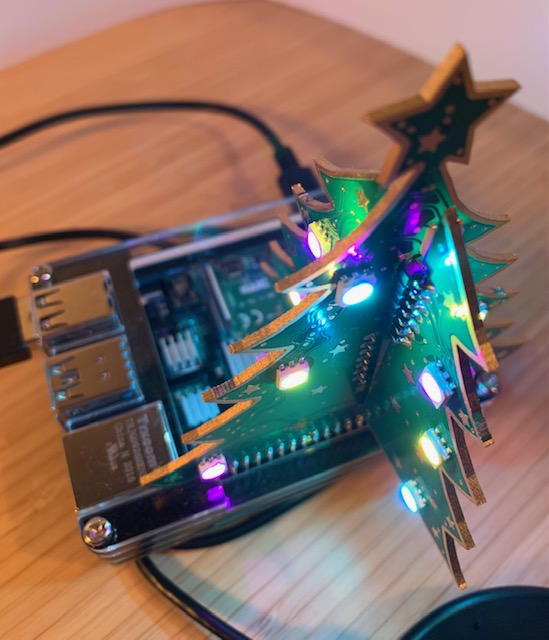

# A voice-controlled Raspberry Pi Christmas Tree

## Introduction
This repository contains some experiments with PiHut's [3D Xmas Tree](https://thepihut.com/products/3d-xmas-tree-for-raspberry-pi). There are two core scripts:
* [`my-tree.py`](my-tree.py): Simple tree which gently pulses through different hues in a slow disco fashion.
tree that [cycles the LEDs](https://media.giphy.com/media/1Q0XQeQE6fUTOgdEQn/giphy-downsized-large.gif) in a variable pattern that can't be changed.
* [`my-voice-tree.py`](my-voice-tree.py): A voice-controlled tree that you can change the lights on in a number of ways [by speaking to it](https://www.youtube.com/watch?v=oPNQIW4BptQ). Supported commands include "Christmas tree blue|red|green|white" to change the tree to , "christmas tree phase" to cycle through LED hues, "christmas tree disco" to revert to the same pattern used by `my-tree.py`.  It is also possible to get the tree to speak using "christmas tree speak".  To generate a new utterance "this is my message" use "christmas tree generate this is my message".  The voice tree uses AWS Transcribe and Polly to work its Christmas magic. 


`my-tree.py`               |  `my-voice-tree.py`
:-------------------------:|:-------------------------:
[](https://media.giphy.com/media/1Q0XQeQE6fUTOgdEQn/giphy-downsized-large.gif)  | <a href="https://youtu.be/YopBvuAIyBU"></a>

## Equipment List
Here's the full set of kit you need to recreate the both the disco and voice-controlled trees together with their prices as of November 2021:
* **Raspberry Pi 4**: Available from PiHut [here](https://thepihut.com/products/raspberry-pi-4-model-b) for £54.
* **RPi case**: The one used here is the multilayer acrylic case available [on Amazon](https://www.amazon.co.uk/GeeekPi-Acrylic-Raspberry-Model-Heatsinks/dp/B07TVLTMX3) for £11.  To fit the tree you have to remove the fan and some of the top layers. 
* **RPi XmasTree3D**: Available pre-soldered from PiHut [here](https://thepihut.com/products/3d-xmas-tree-for-raspberry-pi) for £15.
* **ReSpeaker USB Mic Array**: Available from Pimoroni [here](https://shop.pimoroni.com/products/respeaker-usb-mic-array) for £63.
* **3 way jack connected speaker**: A cheap non-powered one is fine as we will plug into into the ReSpeaker unit for amplification. You can pick [one of these](https://www.amazon.co.uk/TRIXES-Portable-Travel-Speaker-iPhone/dp/B003TKTUUY) up on Amazon for under £10.

Total price for the above kit is £153.  You will also need a monitor, keyboard, mouse and associated cables for the Raspberry Pi.

## Hardware Configuration
For both scripts you need to first follow the PiHut instructions for how to construct the 3D Xmas tree.  It's relatively straightforward for the pre-soldered tree which is comprised of three separate sections that clip together.  Once you have plugged your tree into GPIO on a Raspberry Pi 4, no additional dependencies are required in order to run `my-tree.py` apart from `tree.py` which you download as follows before running the script to test everything works.  This should work because Python GPIO support is available out of the box on the Raspberry Pi 4 and this is the only additional dependency needed for `my-tree.py`:
```
$ git clone https://github.com/malminhas/raspberrypi-xmastree
$ cd raspberrypi-xmastree
$ wget https://bit.ly/2Lr9CT3 -O tree.py
$ python3 my-tree.py 
```
To run `my-voice-tree.py` for a voice-controlled tree you will need to do some additional configuration:
* Plug in the ReSpeaker unit via a USB port on the Raspberry Pi.  Try either `lsusb` and `usb-devices` to check it is picked up.  The LEDs on the ReSpeaker unit should light up.
* The 3.5 inch jack passive speaker should be connected to the 3.5 inch socket on the ReSpeaker unit.
* Set up sound support to point to the ReSpeaker unit following the instructions outlined [here](https://projects.raspberrypi.org/en/projects/raspberry-pi-using/4)
* You will need an audio player.  VLC comes as default and that's what this script uses.  Check it works by typing `vlc` in a terminal which should launch it.
* Set up networking on your Raspberry Pi.  You will need a valid WiFI connection for AWS commands to work.
* It's a good idea to also change locale character set to UTF-8 for dumping to terminal.  You can change it as explained [here](https://raspberrytips.com/change-language-raspberry-pi/) by going to `Raspberry Pi Configuration -> Localisation -> Locale -> Character Set UTF-8`

## Software Configuration
There are a number of separate steps involved in setting up your Raspberry Pi 4 software environment.  If you already have `virtualenv` and AWS `awscli` support in place on your Raspberry Pi, you should be able to fast track all this by installing all `python` requirements thus:
```
(aws) $ pip install -r requirements.txt
```
The following sections provided more a more detailed walk-through.

### Python3
Change the `/usr/bin/python` link to point to `python3` if it is pointing to `python2`.
Check `pip` is also configured to work with `python3`.

### virtualenv
Unless you already have `virtualenv` support configured on your Raspberry Pi, it is recommended you install `virtualenv` into the default Python setup as follows:
```
$ pip install virtualenv
$ virtualenv
```
Then copy the following lines to your `~/.bashrc` file:
```
export WORKON_HOME=$HOME/.virtualenvs
export PROJECT_HOME=~/Desktop/CODE
export VIRTUALENVWRAPPER_PYTHON=/usr/bin/python3
export VIRTUALENVWRAPPER_VIRTUALENV=/usr/local/bin/virtualenv
source /usr/local/bin/virtualwrapper.sh
export VIRTUALENVWRAPPER_ENV_BIN_DIR=bin
```
Now you can source your `.bashrc` file to setup `virtualenv` support:
```
$ source ~/.bashrc
```
And use it to create a Python3 virtualenv called `aws` as follows:
```
$ mkvirtualenv aws
(aws) $ 
```
You can now switch to this virtualenv anytime using `workon` as follows:
```
$ workon aws
```
The remaining sections assume you have setup a `virtualenv` callend `aws`.

### GPIO support in virtualenv
If you followed the instructions in the Hardware section you should have `tree.py` from PiHut's [`rgbxmastree`](https://github.com/ThePiHut/rgbxmastree) repository in your local directory along with `my-tree.py` and `my-voice-tree.py`. If you haven't done this yet you need to download the `tree` module to your local directory as follows:
```
(aws) $ wget https://bit.ly/2Lr9CT3 -O tree.py
```
Now you need to set up gpiozero support within your `virtualenv` which requires installing the following packages into it:
```
(aws) $ pip install gpiozero RPi.GPIO
```
You should now be able to light up the disco tree within your `virtualenv`:
```
(aws) $ python my-tree.py
```

### awscli
The voice tree leverages AWS Transcribe and AWS Polly.  In order to setup AWS support you will need to have a valid account and set up an access key and secret access key per the AWS instructions [here](https://docs.aws.amazon.com/cli/latest/userguide/cli-chap-welcome.html).  Now you can `aws configure`.  Note this is strictly only within your virtualenv:
```
(aws) $ pip install awscli
(aws) $ aws configure
AWS Access Key ID [None]: <your access key>
AWS Secret Access Key [None]: <your secret access key>
Default region name [None]: us-west-1
Default output format [None]: json
```
Now you can test that it all works using `awscli` thus:
```
(aws) $ aws s3 ls
(aws) $ aws translate translate-text —source-language-code “en” —target-language-code “es” —text “hello, world”
{
	“TranslatedText”: “hola, mundo”,
	“SourceLanaguageCode”: “en”,
	“TargetLanguageCode”: “es”
}
```

### AWS Polly
[Amazon Polly](https://aws.amazon.com/polly/) is an AWS service that turns text into lifelike speech, allowing you to create applications that talk, and build entirely new categories of speech-enabled products. Polly's Text-to-Speech (TTS) service uses advanced deep learning technologies to synthesize natural sounding human speech.  You can access it from AWS CLI to create a playable local .mp3 file as follows:
```
(aws) $ aws polly synthesize-speech —output-format mp3 —voice-id Joanna —text ‘May the force be with you!’ star.mp3
```
AWS Polly is supported via `boto3` which you need to install as follows:
```
(aws) $ pip install boto3
```

### AWS Transcribe
[Amazon Transcribe](https://aws.amazon.com/transcribe/) is an automatic speech recognition (ASR) service that makes it easy for developers to add speech to text capability to their applications and pay as they go.   You can check you are able to round trip the previous mp3 back to text using `awscli` per the instructions [here](https://docs.aws.amazon.com/transcribe/latest/dg/getting-started-cli.html).  You can download the example code to try it out as follows:
```
(aws) $ pip install amazon-transcribe
(aws) $ git clone https://github.com/awslabs/amazon-transcribe-streaming-sdk
(aws) $ cd amazon-transcribe-streaming-sdk/
```
You will need to modify the code to point to the right file location which requires modifying `simple_file.py` in the examples:
```
async with ...
aync with ...
```
Once you've done that you can try it out in file mode: 
```
(aws) $ cd amazon-transcribe-streaming-sdk/examples
(aws) $ pip install aiofileema
(aws) $ python simple_file.py
This is a two
This is a test.
This is a test.
This is a test.
```
Now you need to set up streaming audio integration with the ReSpeaker microphone.  Plug it in then try the following and if all is well you should be able to pick up audio completions converted to text in the terminal as shown for the utterance "Christmas tree red":
```
(aws) $ pip install sounddevice
(aws) $ sudo apt-get install libportaudio2
(aws) $ python simple_mic.py
Christmas
Christmas tree red.
```
You should now finally be able to light up the voice controlled tree:
```
(aws) $ python my-voice-tree.py
```

## Run on boot

### `my-tree.py`
Running this script on boot means you can connect your Raspberry Pi 4 to a power source and remove all other peripherals and it will boot into automatically running `my-tree.py`.  In order to do that you need to boot into the right `virtualenv` then run the script.  To do so, add the following lines to your `/etc/rc.local` file on the Raspberry Pi.   This assumes the home directory you are working in is `/home/pi/Desktop/CODE`:
```
. /home/pi/.virtualenvs/aws/bin/activate
python /home/pi/Desktop/CODE/raspberrypi-xmastree/my-tree.py
```
Make sure it is owned by root and executable.  You can test it locally thus: 
```
$ sudo /etc/rc.local
```
Once you've tested it works you should be able to run your tree off a discreetly connected USB-C power pack and it should look like [this](https://media2.giphy.com/media/1Q0XQeQE6fUTOgdEQn/giphy.gif?cid=790b761151d2a971a18df841f08595c8b9b9747719aaa76e&rid=giphy.gif&ct=g):

### `my-voice-tree.py`
Running `my-voice-tree.py` at boot is more complicated because of the additional dependencies on having network connectivity and audio and microphone support.  Some of the steps involved are as follows:
* Set up the following environment variables at boot in a `local.env` file:
```
WORKING_DIR
AWS_ACCESS_KEY
AWS_SECRET_ACCESS_KEY
AWS_DEFAULT_REGION
```
* Change `/etc/rc.local` by adding the following lines at the end:
```
source /home/.pi/Desktop/CODE/local.env
. /home/pi/.virtualenvs/aws/bin/activate
python /home/pi/Desktop/CODE/raspberrypi-xmastree/my-voice-tree.py
```
* Test your `/etc/rc.local` changes will work as follows:
```
$ sudo /etc/rc.local
```
* Reboot
There is one remaining problem which is to get `pulseaudio` to start on headless boot.  On the Raspberry it only starts up when booting into Desktop.  [This resource](https://askubuntu.com/questions/28176/how-do-i-run-pulseaudio-in-a-headless-server-installation) looks like a useful starting point.
