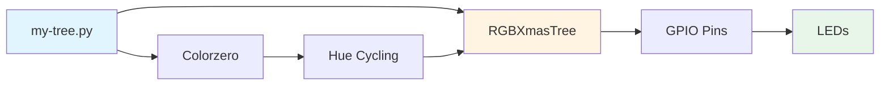
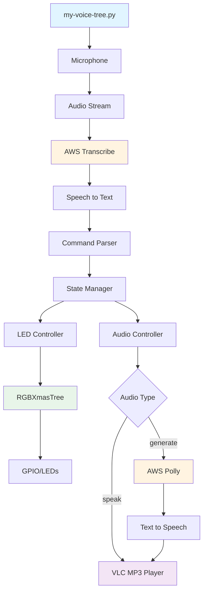
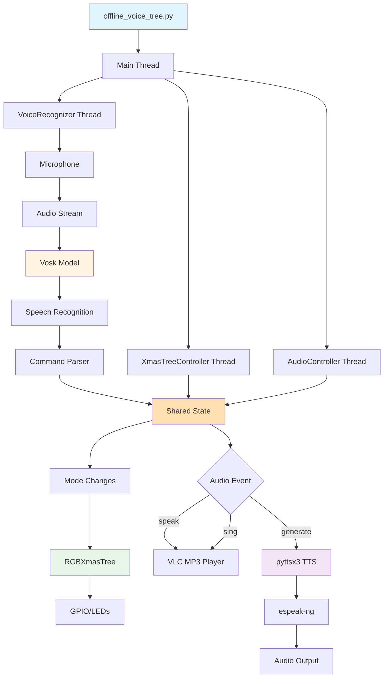

# A Voice-Controlled Raspberry Pi Christmas Tree

## Introduction

This repository contains experiments with PiHut's [3D Xmas Tree](https://thepihut.com/products/3d-xmas-tree-for-raspberry-pi). The project includes three main scripts:

* **[`my-tree.py`](my-tree.py)**: A simple disco tree that gently pulses through different hues in a slow, colorful pattern. The LEDs [cycle through colors](https://media.giphy.com/media/1Q0XQeQE6fUTOgdEQn/giphy-downsized-large.gif) in a variable pattern that can't be changed.

* **[`my-voice-tree.py`](my-voice-tree.py)**: A cloud-based voice-controlled tree that uses AWS Transcribe and Polly for speech recognition and synthesis. You can change the lights by speaking commands like "christmas tree blue|red|green|white", "christmas tree phase" to cycle through LED hues, or "christmas tree disco" to revert to the disco pattern. The tree can also speak using "christmas tree speak" or generate custom speech with "christmas tree generate this is my message". See it in action [here](https://youtu.be/YopBvuAIyBU).

* **[`offline_voice_tree.py`](offline_voice_tree.py)**: A modern, **offline alternative** that runs entirely on the Raspberry Pi without any internet connectivity or AWS services. Uses Vosk for offline speech recognition and pyttsx3 for local text-to-speech, so your festive light show continues to work even when your network is down. Perfect for standalone installations or when you want to avoid cloud dependencies.

`my-tree.py`               |  `my-voice-tree.py`
:-------------------------:|:-------------------------:
[](https://media.giphy.com/media/1Q0XQeQE6fUTOgdEQn/giphy-downsized-large.gif)  | <a href="https://youtu.be/YopBvuAIyBU"></a>

## Equipment List

Here's the full set of kit you need to recreate both the disco and voice-controlled trees:

* **Raspberry Pi 4 or 5**: Raspberry Pi 4 available from PiHut [here](https://thepihut.com/products/raspberry-pi-4-model-b) for £33.60.
* **RPi case**: The one used here is the multilayer acrylic case available [on Amazon](https://www.amazon.co.uk/GeeekPi-Acrylic-Raspberry-Model-Heatsinks/dp/B07TVLTMX3) for £11. To fit the tree you have to remove the fan and some of the top layers.
* **RPi XmasTree3D**: Available pre-soldered from PiHut [here](https://thepihut.com/products/3d-xmas-tree-for-raspberry-pi) for £15.
* **ReSpeaker USB Mic Array**: Available from Pimoroni [here](https://shop.pimoroni.com/products/respeaker-usb-mic-array) for £63.
* **3.5mm jack connected speaker**: A cheap non-powered one is fine as we will plug it into the ReSpeaker unit for amplification. You can pick [one of these](https://www.amazon.co.uk/TRIXES-Portable-Travel-Speaker-iPhone/dp/B003TKTUUY) up on Amazon for under £10.

Total price for the above kit is £153. You will also need a monitor, keyboard, mouse and associated cables for the Raspberry Pi.

## Hardware Configuration

For all scripts, you need to first follow the PiHut instructions for how to construct the 3D Xmas tree. It's relatively straightforward for the pre-soldered tree which is comprised of three separate sections that clip together.

Once you have plugged your tree into GPIO on a Raspberry Pi 4 or 5, download the repository:

```bash
$ git clone git@github.com:malminhas/raspberrypi-xmastree.git
$ cd raspberrypi-xmastree
$ wget https://bit.ly/2Lr9CT3 -O tree.py
```

For voice-controlled trees (`my-voice-tree.py` or `offline_voice_tree.py`), you'll need to:

* Plug in the ReSpeaker unit via a USB port on the Raspberry Pi. Check it's detected with `lsusb` or `usb-devices`. The LEDs on the ReSpeaker unit should light up.
* Connect the 3.5mm jack passive speaker to the 3.5mm socket on the ReSpeaker unit.
* Set up sound support to point to the ReSpeaker unit following the instructions outlined [here](https://projects.raspberrypi.org/en/projects/raspberry-pi-using/4)
* For `my-voice-tree.py`, ensure you have network connectivity for AWS services.

## Software Configuration

### Basic Setup

#### GPIO Support (Raspberry Pi 4/5)

On Raspberry Pi 5, GPIO system support is already in place. Install the required system packages:

```bash
$ sudo apt install python3-gpiozero python3-lgpio
```

Create a virtual environment with system site packages to use the system GPIO libraries:

```bash
$ python3 -m venv --system-site-packages ~/.virtualenvs/xmastree
$ source ~/.virtualenvs/xmastree/bin/activate
# Or if using virtualenvwrapper:
$ workon xmastree
```

You should now be able to test the basic tree:

```bash
(xmastree) $ python my-tree.py
```

#### Virtual Environment Setup

If you prefer using `virtualenvwrapper`, install and configure it:

```bash
$ pip install virtualenv virtualenvwrapper
```

Add the following to your `~/.bashrc`:

```bash
export WORKON_HOME=$HOME/.virtualenvs
export PROJECT_HOME=~/Desktop/CODE
export VIRTUALENVWRAPPER_PYTHON=/usr/bin/python3
export VIRTUALENVWRAPPER_VIRTUALENV=/usr/local/bin/virtualenv
source /usr/local/bin/virtualenvwrapper.sh
export VIRTUALENVWRAPPER_ENV_BIN_DIR=bin
```

Then source your `.bashrc`:

```bash
$ source ~/.bashrc
$ mkvirtualenv xmastree --system-site-packages
```

---

## my-tree.py - Simple Disco Tree

### Key Features

* Simple, standalone disco mode that cycles LEDs through different hues
* No external dependencies beyond GPIO support
* Perfect for testing your hardware setup
* Runs continuously until interrupted

### Installation

The basic tree requires minimal setup:

```bash
# Ensure GPIO support is installed (see Basic Setup above)
(xmastree) $ python my-tree.py
```

### System Architecture



---

## my-voice-tree.py - Cloud-Based Voice Control

### Key Features

* **Voice commands**: Control the tree with natural speech ("christmas tree red", "christmas tree disco", etc.)
* **AWS Transcribe**: Real-time speech-to-text conversion
* **AWS Polly**: Text-to-speech synthesis for custom messages
* **Multiple modes**: Solid colors, disco, phase cycling
* **Audio playback**: Play MP3 files and generate speech
* **Requires internet connectivity** for AWS services

### Installation

#### Prerequisites

1. **VLC** (usually pre-installed on Raspberry Pi):
   ```bash
   (xmastree) $ pip install python-vlc
   ```

2. **Audio Support**:
   ```bash
   $ sudo apt install portaudio19-dev
   (xmastree) $ pip install sounddevice
   ```

   Test audio device detection:
   ```bash
   $ python3 -c "import sounddevice as sd; print(sd.query_devices())"
   ```

3. **AWS Configuration**:

   Create a `local.env` file with your AWS credentials:
   ```bash
   export WORKING_DIR=/home/pi/Desktop/CODE/raspberrypi-xmastree
   export AWS_ACCESS_KEY_ID=your_access_key_here
   export AWS_SECRET_ACCESS_KEY=your_secret_key_here
   export AWS_DEFAULT_REGION=us-west-2
   ```

   Source the environment file:
   ```bash
   $ source local.env
   ```

   Verify AWS configuration:
   ```bash
   $ aws sts get-caller-identity
   ```

4. **Install AWS Dependencies**:
   ```bash
   (xmastree) $ pip install awscli boto3 awscrt
   (xmastree) $ pip install amazon-transcribe aiofile
   ```

#### Running the Script

```bash
(xmastree) $ source local.env
(xmastree) $ python my-voice-tree.py
```

### System Architecture



### Supported Commands

* **Colors**: `christmas tree red|green|blue|yellow|orange|purple|white|pink|brown|black`
* **Modes**: `christmas tree disco|phase`
* **Audio**: `christmas tree speak` (plays bundled MP3)
* **TTS**: `christmas tree generate <your message here>` (generates speech via AWS Polly)
* **Music**: `christmas tree sing` (plays configured song)

---

## offline_voice_tree.py - Offline Voice Control

### Key Features

* **Fully offline**: No internet connection required
* **Vosk speech recognition**: On-device speech-to-text using local models
* **Local TTS**: Text-to-speech using pyttsx3 (espeak-ng)
* **Same command set**: Compatible with `my-voice-tree.py` commands
* **Thread-based architecture**: Separate threads for voice recognition, LED control, and audio
* **Graceful shutdown**: Handles CTRL-C cleanly without crashes

### Installation

#### Prerequisites

1. **VLC** (usually pre-installed):
   ```bash
   (xmastree) $ pip install python-vlc
   ```

2. **Audio Support**:
   ```bash
   $ sudo apt install portaudio19-dev
   (xmastree) $ pip install sounddevice
   ```

3. **Vosk Speech Recognition**:
   ```bash
   (xmastree) $ pip install vosk
   ```

   Download a Vosk language model (small English model recommended for Raspberry Pi):
   ```bash
   $ cd raspberrypi-xmastree
   $ wget https://alphacephei.com/vosk/models/vosk-model-small-en-us-0.15.zip
   $ unzip vosk-model-small-en-us-0.15.zip
   $ mv vosk-model-small-en-us-0.15 model
   ```

   Or set a custom path via environment variable:
   ```bash
   export VOSK_MODEL_PATH=/path/to/your/model
   ```

4. **Text-to-Speech Support**:
   ```bash
   (xmastree) $ pip install pyttsx3
   $ sudo apt install espeak-ng
   ```

#### Running the Script

```bash
(xmastree) $ python offline_voice_tree.py
```

The script will automatically detect and use the ReSpeaker microphone if available, or fall back to the default input device.

### System Architecture



### Thread Architecture

The script uses three cooperative threads:

1. **VoiceRecognizer**: Continuously listens to the microphone, processes audio through Vosk, and updates shared state when commands are recognized.
2. **XmasTreeController**: Monitors shared state and updates LED colors/modes accordingly. Handles disco, phase, and solid color modes.
3. **AudioController**: Responds to audio events (speak, generate, sing) and manages TTS and MP3 playback.

All threads share a `State` object for coordination and use `threading.Event` for signaling.

### Supported Commands

* **Colors**: `christmas tree red|green|blue|yellow|orange|purple|white|pink|brown|black`
* **Modes**: `christmas tree disco|phase`
* **Audio**: `christmas tree speak` (plays bundled MP3 from `speech.mp3`)
* **TTS**: `christmas tree generate <your message here>` (generates speech locally)
* **Music**: `christmas tree sing` (plays configured song from `08-I-Wish-it-Could-be-Christmas-Everyday.mp3`)

### Configuration

You can customize the following paths in the script:

* `SPEECH_MP3_PATH`: Path to MP3 file for "speak" command (default: `speech.mp3`)
* `SING_MP3_PATH`: Path to song file for "sing" command (default: `08-I-Wish-it-Could-be-Christmas-Everyday.mp3`)
* `MODEL_PATH`: Path to Vosk model directory (default: `./model` or `VOSK_MODEL_PATH` env var)

---

## Run on Boot

### my-tree.py

Running this script on boot means you can connect your Raspberry Pi to a power source and remove all other peripherals. Add the following to `/etc/rc.local`:

```bash
. /home/pi/.virtualenvs/xmastree/bin/activate
python /home/pi/Desktop/CODE/raspberrypi-xmastree/my-tree.py
```

Make sure `/etc/rc.local` is owned by root and executable. Test it:

```bash
$ sudo /etc/rc.local
```

### my-voice-tree.py

Running `my-voice-tree.py` at boot requires network connectivity and audio support. Steps:

1. Create a `local.env` file with environment variables:
   ```bash
   export WORKING_DIR=/home/pi/Desktop/CODE/raspberrypi-xmastree
   export AWS_ACCESS_KEY_ID=your_key_here
   export AWS_SECRET_ACCESS_KEY=your_secret_here
   export AWS_DEFAULT_REGION=us-west-2
   ```

2. Update `/etc/rc.local`:
   ```bash
   source /home/pi/Desktop/CODE/local.env
   . /home/pi/.virtualenvs/xmastree/bin/activate
   python /home/pi/Desktop/CODE/raspberrypi-xmastree/my-voice-tree.py
   ```

3. Test and reboot:
   ```bash
   $ sudo /etc/rc.local
   ```

Note: You may need to configure `pulseaudio` to start on headless boot. See [this resource](https://askubuntu.com/questions/28176/how-do-i-run-pulseaudio-in-a-headless-server-installation) for guidance.

### offline_voice_tree.py

Running the offline version at boot is simpler as it doesn't require network connectivity:

1. Update `/etc/rc.local`:
   ```bash
   . /home/pi/.virtualenvs/xmastree/bin/activate
   python /home/pi/Desktop/CODE/raspberrypi-xmastree/offline_voice_tree.py
   ```

2. Test and reboot:
   ```bash
   $ sudo /etc/rc.local
   ```

The offline version is ideal for standalone installations where network connectivity cannot be guaranteed.

---

## Comparison: Cloud vs Offline

| Feature | my-voice-tree.py | offline_voice_tree.py |
|---------|-----------------|----------------------|
| Internet Required | ✅ Yes | ❌ No |
| Speech Recognition | AWS Transcribe | Vosk (local) |
| Text-to-Speech | AWS Polly | pyttsx3 (espeak-ng) |
| Setup Complexity | Higher (AWS config) | Lower (model download) |
| Cost | Pay-per-use AWS | Free (one-time model) |
| Latency | Network dependent | Local (faster) |
| Privacy | Audio sent to AWS | Fully local |
| Best For | Cloud-enabled setups | Standalone/offline use |

---

## Troubleshooting

### Audio Device Not Found

If the ReSpeaker isn't detected:

```bash
$ lsusb | grep -i respeaker
$ python3 -c "import sounddevice as sd; print(sd.query_devices())"
```

The script will automatically fall back to the default input device if ReSpeaker isn't found.

### Vosk Model Not Found

Ensure the model is downloaded and extracted:

```bash
$ ls -la model/
$ export VOSK_MODEL_PATH=/path/to/model  # if using custom path
```

### GPIO Errors

On Raspberry Pi 5, ensure you're using system site packages:

```bash
$ python3 -m venv --system-site-packages ~/.virtualenvs/xmastree
```

### TTS Not Working

For `offline_voice_tree.py`, ensure espeak-ng is installed:

```bash
$ sudo apt install espeak-ng
$ espeak-ng --version
```

---

## License

This project is provided as-is for educational and entertainment purposes.
