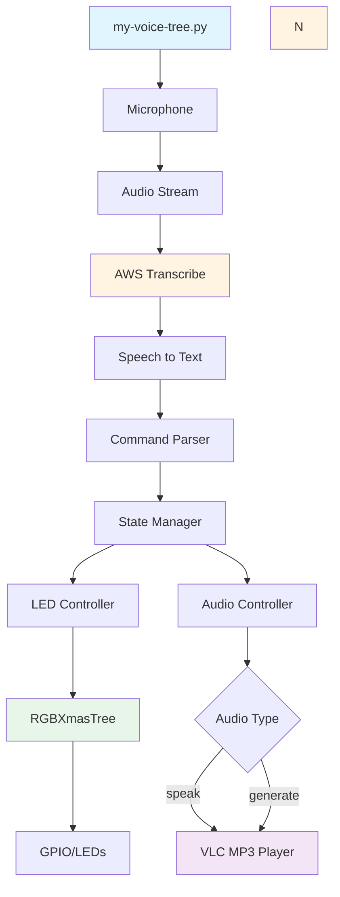
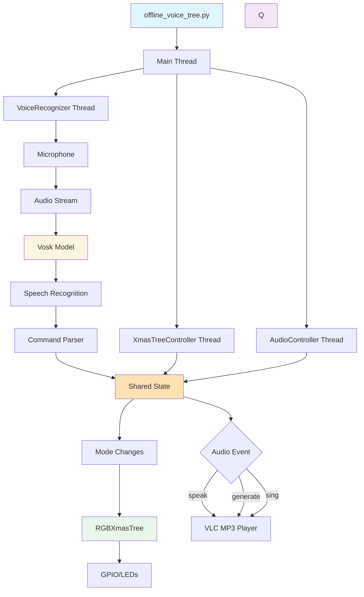

# A Voice-Controlled Raspberry Pi Christmas Tree

## Introduction

This repository contains experiments with PiHut's [3D Xmas Tree](https://thepihut.com/products/3d-xmas-tree-for-raspberry-pi). For detailed architecture documentation of the offline voice-controlled system, see [ARCHITECTURE.md](ARCHITECTURE.md). For development guidance, see [CLAUDE.md](CLAUDE.md).

The project includes three main scripts:

* **[`my-tree.py`](my-tree.py)**: A simple disco tree that gently pulses through different hues in a slow, colorful pattern. The LEDs [cycle through colors](https://media.giphy.com/media/1Q0XQeQE6fUTOgdEQn/giphy-downsized-large.gif) in a variable pattern that can't be changed.

* **[`my-voice-tree.py`](my-voice-tree.py)**: A cloud-based voice-controlled tree that uses AWS Transcribe for speech recognition. You can change the lights by speaking commands like "christmas tree blue|red|green|white", "christmas tree phase" to cycle through LED hues, or "christmas tree disco" to revert to the disco pattern. The tree can also speak using "christmas tree speak" (plays the `speech.mp3` file) or "christmas tree generate" (plays the `speech.mp3` file). See it in action [here](https://youtu.be/YopBvuAIyBU).  Note that running this script over an extended period can be expensive.

* **[`offline_voice_tree.py`](offline_voice_tree.py)**: A modern, **offline alternative** that runs entirely on the Raspberry Pi without any internet connectivity or AWS services. Uses [Vosk](https://alphacephei.com/vosk/models) for offline speech recognition and `pyttsx3` for local text-to-speech, so your festive light show works without requiring a network connection or incurring AWS charges. Perfect for standalone installations or when you want to avoid cloud dependencies.

`my-tree.py`               |  `my-voice-tree.py`
:-------------------------:|:-------------------------:
[](https://media.giphy.com/media/1Q0XQeQE6fUTOgdEQn/giphy-downsized-large.gif)  | <a href="https://youtu.be/YopBvuAIyBU"></a>

## Equipment List

Here's the full set of kit you need to recreate both the disco and voice-controlled trees:

* **Raspberry Pi 4 or 5**: Raspberry Pi 4 available from PiHut [here](https://thepihut.com/products/raspberry-pi-4-model-b) for £33.60.
* **RPi case**: The one used with the Raspberry Pi  is the multilayer acrylic case available [on Amazon](https://www.amazon.co.uk/GeeekPi-Acrylic-Raspberry-Model-Heatsinks/dp/B07TVLTMX3) for £11. To fit the tree you have to remove the fan and some of the top layers.
* **RPi XmasTree3D**: Available pre-soldered from PiHut [here](https://thepihut.com/products/3d-xmas-tree-for-raspberry-pi) for £15.
* **ReSpeaker USB Mic Array**: Available from Pimoroni [here](https://shop.pimoroni.com/products/respeaker-usb-mic-array) for £63.
* **3.5mm jack connected speaker**: A cheap non-powered one is fine as we will plug it into the ReSpeaker unit for amplification. You can pick [one of these](https://www.amazon.co.uk/TRIXES-Portable-Travel-Speaker-iPhone/dp/B003TKTUUY) up on Amazon for under £10.

Total price for the above kit is £153. You will also need a monitor, keyboard, mouse and associated cables for the Raspberry Pi.

## Hardware Configuration

For all scripts, you need to first follow the PiHut instructions for how to construct the 3D Xmas tree. It's relatively straightforward for the pre-soldered tree which is comprised of three separate sections that clip together.

Once you have plugged your tree into GPIO on a Raspberry Pi 4 or 5, clone the repository:

```bash
$ git clone git@github.com:malminhas/raspberrypi-xmastree.git
$ cd raspberrypi-xmastree
```

For voice-controlled trees (`my-voice-tree.py` or `offline_voice_tree.py`), you'll need to:

* Plug in the ReSpeaker unit via a USB port on the Raspberry Pi. Check it's detected with `lsusb` or `usb-devices`. The LEDs on the ReSpeaker unit should light up.
* Connect the 3.5mm jack passive speaker to the 3.5mm socket on the ReSpeaker unit.
* Set up sound support to point to the ReSpeaker unit following the instructions outlined [here](https://projects.raspberrypi.org/en/projects/raspberry-pi-using/4)
* For `my-voice-tree.py`, ensure you have network connectivity for AWS services.

## Software Configuration

### Basic Setup

#### GPIO Support (Raspberry Pi 4/5)

On Raspberry Pi 5, GPIO system support is already in place. Install the required system packages if needed on Raspberry Pi 4:

```bash
$ sudo apt install python3-gpiozero python3-lgpio
```

Create a virtual environment with system site packages to use the system GPIO libraries:

```bash
$ python3 -m venv --system-site-packages ~/.virtualenvs/xmastree
$ source ~/.virtualenvs/xmastree/bin/activate
# Or if using virtualenvwrapper:
$ workon xmastree
```

Install base dependencies:

```bash
(xmastree) $ pip install -r requirements.txt
```

You should now be able to test the basic tree:

```bash
(xmastree) $ python my-tree.py
```

#### Virtual Environment Setup

If you prefer using `virtualenvwrapper`, install and configure it:

```bash
$ pip install virtualenv virtualenvwrapper
```

Add the following to your `~/.bashrc`:

```bash
export WORKON_HOME=$HOME/.virtualenvs
export PROJECT_HOME=~/Desktop/CODE
export VIRTUALENVWRAPPER_PYTHON=/usr/bin/python3
export VIRTUALENVWRAPPER_VIRTUALENV=/usr/local/bin/virtualenv
source /usr/local/bin/virtualenvwrapper.sh
export VIRTUALENVWRAPPER_ENV_BIN_DIR=bin
```

Then source your `.bashrc`:

```bash
$ source ~/.bashrc
$ mkvirtualenv xmastree --system-site-packages
```

---

## my-tree.py - Simple Disco Tree

### Key Features

* Simple, standalone disco mode that cycles LEDs through different hues
* No external dependencies beyond GPIO support
* Perfect for testing your hardware setup
* Runs continuously until interrupted

### Installation

The basic tree requires minimal setup:

```bash
# Ensure GPIO support is installed (see Basic Setup above)
(xmastree) $ python my-tree.py
```

### System Architecture


---

## my-voice-tree.py - Cloud-Based Voice Control

### Key Features

* **Voice commands**: Control the tree with natural speech ("christmas tree red", "christmas tree disco", etc.)
* **AWS Transcribe**: Real-time speech-to-text conversion
* **Multiple modes**: Solid colors, disco, phase cycling
* **Audio playback**: Play MP3 files via voice commands
* **Requires internet connectivity** for AWS services

### Installation

#### Prerequisites

1. **VLC** (usually pre-installed on Raspberry Pi):
   ```bash
   (xmastree) $ pip install python-vlc
   ```

2. **Audio Support**:
   ```bash
   $ sudo apt install portaudio19-dev
   (xmastree) $ pip install sounddevice
   ```

   Test audio device detection:
   ```bash
   $ python3 -c "import sounddevice as sd; print(sd.query_devices())"
   ```

3. **AWS Configuration**:

   Create a `local.env` file in the project root with your AWS credentials:
   ```bash
   export WORKING_DIR=/home/pi/Desktop/CODE/raspberrypi-xmastree
   export AWS_ACCESS_KEY_ID=your_access_key_here
   export AWS_SECRET_ACCESS_KEY=your_secret_key_here
   export AWS_DEFAULT_REGION=us-west-2
   ```

   **Note**: The `my-voice-tree.py` script automatically loads `local.env` using python-dotenv, so you don't need to manually source it. However, if you're running commands from the terminal, you may still need to source it for those commands.

   Verify AWS configuration:
   ```bash
   $ aws sts get-caller-identity
   ```

4. **Install AWS Dependencies**:
   ```bash
   (xmastree) $ pip install awscli boto3 awscrt
   (xmastree) $ pip install amazon-transcribe aiofile
   ```

#### Running the Script

The script automatically loads environment variables from `local.env` if present:
```bash
(xmastree) $ python my-voice-tree.py
```

**Note**: If you need to use AWS CLI commands separately, you may still need to source `local.env`:
```bash
$ source local.env
```

### System Architecture



### Supported Commands

* **Colors**: `christmas tree red|green|blue|yellow|orange|purple|white|pink|brown|black`
* **Modes**: `christmas tree disco|phase`
* **Audio**: `christmas tree speak` (plays `speech.mp3` file)
* **Audio**: `christmas tree generate` (generates speech using default text)
* **Music**: `christmas tree sing` (plays configured song)

---

## offline_voice_tree.py - Offline Voice Control

### Key Features

* **Fully offline**: No internet connection required for core functionality
* **Vosk speech recognition**: On-device speech-to-text using local models
* **Flexible TTS**: Text-to-speech using pyttsx3 (espeak-ng) or Piper TTS (high-quality neural TTS)
* **Dual LLM provider support** (optional): Dynamic joke and flattery generation via GreenPT API (cloud) or Ollama (local) with session-based repetition avoidance
* **Privacy-focused AI**: Choose between cloud LLM (GreenPT) or fully local LLM (Ollama) via `--llm-provider` argument
* **Same command set**: Compatible with `my-voice-tree.py` commands
* **Thread-based architecture**: Separate threads for voice recognition, LED control, and audio
* **Command-line options**: Choose TTS engine via `--tts-engine` and LLM provider via `--llm-provider` arguments
* **Graceful shutdown**: Handles CTRL-C cleanly without crashes

### Installation

#### Prerequisites

1. **VLC** (usually pre-installed):
   ```bash
   (xmastree) $ pip install python-vlc
   ```

2. **Audio Support**:
   ```bash
   $ sudo apt install portaudio19-dev
   (xmastree) $ pip install sounddevice
   ```

3. **Vosk Speech Recognition**:
   ```bash
   (xmastree) $ pip install vosk
   ```

   Download a Vosk language model (small English model recommended for Raspberry Pi):
   ```bash
   $ cd raspberrypi-xmastree
   $ wget https://alphacephei.com/vosk/models/vosk-model-small-en-us-0.15.zip
   $ unzip vosk-model-small-en-us-0.15.zip
   $ mv vosk-model-small-en-us-0.15 model
   ```

   Or set a custom path via environment variable:
   ```bash
   export VOSK_MODEL_PATH=/path/to/your/model
   ```

4. **Text-to-Speech Support**:
   ```bash
   (xmastree) $ pip install pyttsx3
   $ sudo apt install espeak-ng
   ```
   
   **Optional - Piper TTS** (for higher quality speech):
   See [INSTALL_PIPER.md](INSTALL_PIPER.md) for detailed installation instructions.
   Piper TTS provides neural TTS with much better quality than espeak-ng.

5. **HTTP Client** (for joke and flatter commands):
   ```bash
   (xmastree) $ pip install requests python-dotenv
   ```

#### Running the Script

**Basic usage** (auto-detects TTS engine):
```bash
(xmastree) $ python offline_voice_tree.py
```

**With TTS engine selection**:
```bash
# Force Piper TTS (requires PIPER_MODEL_PATH environment variable)
(xmastree) $ python offline_voice_tree.py --tts-engine piper

# Force pyttsx3 (espeak-ng backend)
(xmastree) $ python offline_voice_tree.py --tts-engine pyttsx3

# Auto-detect (default - prefers Piper if available)
(xmastree) $ python offline_voice_tree.py --tts-engine auto
```

**With LLM provider selection**:
```bash
# Use GreenPT cloud API (default)
(xmastree) $ python offline_voice_tree.py --llm-provider greenpt

# Use local Ollama (requires Ollama running)
(xmastree) $ python offline_voice_tree.py --llm-provider ollama

# Combine TTS and LLM selections
(xmastree) $ python offline_voice_tree.py --tts-engine piper --llm-provider ollama
```

**Show help**:
```bash
(xmastree) $ python offline_voice_tree.py --help
```

The script will automatically detect and use the ReSpeaker microphone if available, or fall back to the default input device. It also automatically extracts the ALSA card number from the device name and uses it for audio playback, ensuring MP3 files play through the ReSpeaker's audio output.

### System Architecture



### Thread Architecture

The script uses three cooperative threads:

1. **VoiceRecognizer**: Continuously listens to the microphone, processes audio through Vosk, and updates shared state when commands are recognized.
2. **XmasTreeController**: Monitors shared state and updates LED colors/modes accordingly. Handles disco, phase, and solid color modes.
3. **AudioController**: Responds to audio events (speak, generate, sing) and manages TTS and MP3 playback. During audio playback, LEDs are turned off (idle mode) and restored to the previous mode when playback completes.

All threads share a `State` object for coordination and use `threading.Event` for signaling.

### Supported Commands

* **Colors**: `christmas tree red|green|blue|yellow|orange|purple|white|pink|brown|black`
* **Modes**: `christmas tree disco|phase`
* **Audio**: `christmas tree speak` (plays `speech.mp3` file)
* **Audio**: `christmas tree generate` (generates speech using selected TTS engine)
* **Music**: `christmas tree sing` (plays configured song from `08-I-Wish-it-Could-be-Christmas-Everyday.mp3`)
* **AI Commands** (requires GreenPT API):
  * `christmas tree joke` (fetches and speaks a family-friendly joke, avoids repetition during session)
  * `christmas tree flatter` (generates and speaks over-the-top praise, avoids repetition during session)

### Audio Playback

The script uses VLC for MP3 playback with ALSA output. It automatically:

* Detects the ReSpeaker device and extracts the ALSA card number from the device name
* Configures VLC to use `plughw:X,0` (where X is the detected card number) for audio output
* Uses the `plughw` plugin which automatically handles sample rate conversion and channel mapping
* Sets playback volume to 50% (adjustable in the `play_mp3` method)

During audio playback (speak, generate, or sing commands), the LEDs are temporarily turned off and restored to the previous mode when playback completes.

### Configuration

You can customize the following paths and settings in the script:

* `SPEECH_MP3_PATH`: Path to MP3 file for "speak" command (default: `speech.mp3`)
* `SING_MP3_PATH`: Path to song file for "sing" command (default: `08-I-Wish-it-Could-be-Christmas-Everyday.mp3`)
* `MODEL_PATH`: Path to Vosk model directory (default: `./model` or `VOSK_MODEL_PATH` env var)

**TTS Engine Configuration**:

The script supports two TTS engines:

1. **pyttsx3** (default, always available):
   - Uses espeak-ng backend
   - Lower quality but no additional setup required
   - Automatically selects best English voice available

2. **Piper TTS** (optional, higher quality):
   - Neural TTS with much better quality
   - Requires installation and model download
   - Set `PIPER_EXECUTABLE_PATH` in `local.env` if piper is in a non-standard location
   - Set `PIPER_MODEL_PATH` in `local.env` or as an environment variable
   - The script automatically loads `local.env` if present
   - The script searches common locations: `/usr/local/bin/piper/piper`, `/usr/local/bin/piper`, `/usr/bin/piper`, `~/.local/bin/piper`
   
   **Voice Models Available:**
   - **US English**: `en_US-lessac-medium` (default), `en_US-lessac-high`, `en_US-joe-medium`
   - **British English**: 
     - `en_GB-aru-medium` - Standard British English (female, recommended)
     - `en_GB-alba-medium` - Scottish accent (female)
     - `en_GB-cori-medium` - British English (female)
     - `northern_english_male` - Northern English (male)
   - Browse all available voices at: https://huggingface.co/rhasspy/piper-voices/tree/v1.0.0
   
   **To use a British English voice (standard English accent):**
   ```bash
   # Download British English voice - Aru (standard English, not Scottish)
   mkdir -p ~/.local/share/piper/models
   cd ~/.local/share/piper/models
   wget https://huggingface.co/rhasspy/piper-voices/resolve/v1.0.0/en/en_GB/aru/medium/en_GB-aru-medium.onnx
   wget https://huggingface.co/rhasspy/piper-voices/resolve/v1.0.0/en/en_GB/aru/medium/en_GB-aru-medium.onnx.json
   
   # Add to local.env:
   export PIPER_MODEL_PATH="$HOME/.local/share/piper/models/en_GB-aru-medium.onnx"
   ```

**Environment Variable Loading**:

All Python scripts (`offline_voice_tree.py`, `greenpt.py`, `ollama.py`) automatically load environment variables from a `local.env` file in the project root using python-dotenv. This means you can create a single `local.env` file with all your configuration:

```bash
# Example local.env file
export VOSK_MODEL_PATH="./model"
export PIPER_EXECUTABLE_PATH="/usr/local/bin/piper/piper"  # Optional: if piper is in non-standard location
export PIPER_MODEL_PATH="$HOME/.local/share/piper/models/en_US-lessac-medium.onnx"
export GREENPT_API_KEY="your_api_key_here"
export GREENPT_MODEL_ID="gemma-3-27b-it"
export OLLAMA_API_BASE_URL="http://localhost:11434"
export OLLAMA_MODEL_ID="gemma2:2b"
```

**Note**: Existing environment variables take precedence over values in `local.env` (override=False), so you can still override values via system environment variables if needed.

**LLM Provider Configuration** (optional, for joke and flatter commands):

The script supports two LLM providers for AI-powered jokes and flattery:

#### Option 1: GreenPT (Cloud LLM)

The `greenpt.py` module provides cloud-based AI content generation via the GreenPT API:

1. Create a `local.env` file in the project root (or set environment variables):
   ```bash
   export GREENPT_API_BASE_URL="https://api.greenpt.ai/v1"
   export GREENPT_API_KEY="your_api_key_here"
   export GREENPT_MODEL_ID="gemma-3-27b-it"  # optional, defaults to gemma-3-27b-it
   ```

2. The `greenpt.py` module automatically loads `local.env` if present (no need to source it).

3. Run the script with GreenPT (default):
   ```bash
   (xmastree) $ python offline_voice_tree.py --llm-provider greenpt
   ```

**Features of GreenPT**:
- Access to large, capable cloud LLM models
- No local compute required
- Requires internet connectivity and API key
- May incur API costs

#### Option 2: Ollama (Local LLM)

The `ollama.py` module provides fully local AI content generation using Ollama:

1. Install Ollama on your Raspberry Pi:
   ```bash
   # Download and install Ollama
   curl -fsSL https://ollama.com/install.sh | sh
   ```

2. Pull a model (smaller models recommended for Raspberry Pi):
   ```bash
   # Recommended: LLaMA 3.2 3B model (suitable for Raspberry Pi)
   ollama pull llama3.2:3b

   # Alternative: Smaller Gemma 2B model
   ollama pull gemma:2b
   ```

3. Start the Ollama server:
   ```bash
   ollama serve
   ```

4. (Optional) Configure in `local.env` file (automatically loaded):
   ```bash
   export OLLAMA_API_BASE_URL="http://localhost:11434"  # default
   export OLLAMA_MODEL_ID="gemma2:2b"  # default, set to your preferred model
   ```

   **Note**: The `ollama.py` module automatically loads `local.env` if present. You can also set these as system environment variables if preferred.

5. Run the script with Ollama:
   ```bash
   (xmastree) $ python offline_voice_tree.py --llm-provider ollama
   ```

**Features of Ollama**:
- Fully local, offline AI inference
- Complete privacy - no data leaves your device
- No API costs
- Requires local compute (2-8GB model + RAM)
- Slower inference on Raspberry Pi

#### Common Features

Both providers support:
- **Session-based repetition avoidance**: Jokes and flattery are tracked during the session to ensure variety
- **Automatic model management**: Selected model is persisted across sessions
- **Graceful degradation**: If unavailable, commands print a warning and continue operation
- **Configurable prompts**: Randomized prompts ensure diverse content generation

If no LLM provider is configured, the joke and flatter commands will print a warning and skip execution. All other commands continue to work normally.

---

## Run on Boot

### my-tree.py

Running this script on boot means you can connect your Raspberry Pi to a power source and remove all other peripherals. Add the following to `/etc/rc.local`:

```bash
. /home/pi/.virtualenvs/xmastree/bin/activate
python /home/pi/Desktop/CODE/raspberrypi-xmastree/my-tree.py
```

Make sure `/etc/rc.local` is owned by root and executable. Test it:

```bash
$ sudo /etc/rc.local
```

### my-voice-tree.py

Running `my-voice-tree.py` at boot requires network connectivity and audio support. Steps:

1. Create a `local.env` file with environment variables:
   ```bash
   export WORKING_DIR=/home/pi/Desktop/CODE/raspberrypi-xmastree
   export AWS_ACCESS_KEY_ID=your_key_here
   export AWS_SECRET_ACCESS_KEY=your_secret_here
   export AWS_DEFAULT_REGION=us-west-2
   ```

2. Update `/etc/rc.local`:
   ```bash
   source /home/pi/Desktop/CODE/local.env
   . /home/pi/.virtualenvs/xmastree/bin/activate
   python /home/pi/Desktop/CODE/raspberrypi-xmastree/my-voice-tree.py
   ```

3. Test and reboot:
   ```bash
   $ sudo /etc/rc.local
   ```

Note: You may need to configure `pulseaudio` to start on headless boot. See [this resource](https://askubuntu.com/questions/28176/how-do-i-run-pulseaudio-in-a-headless-server-installation) for guidance.

### offline_voice_tree.py

Running the offline version at boot is simpler as it doesn't require network connectivity:

1. Update `/etc/rc.local`:
   ```bash
   . /home/pi/.virtualenvs/xmastree/bin/activate
   python /home/pi/Desktop/CODE/raspberrypi-xmastree/offline_voice_tree.py
   ```

2. Test and reboot:
   ```bash
   $ sudo /etc/rc.local
   ```

The offline version is ideal for standalone installations where network connectivity cannot be guaranteed.

---

## Comparison: Cloud vs Offline

| Feature | my-voice-tree.py | offline_voice_tree.py |
|---------|-----------------|----------------------|
| Internet Required | ✅ Yes | ❌ No (optional for GreenPT only) |
| Speech Recognition | AWS Transcribe | Vosk (local) |
| Audio Playback | MP3 files | MP3 + pyttsx3/Piper TTS |
| TTS Quality | N/A | pyttsx3 (basic) or Piper (high-quality neural) |
| AI-Generated Content | ❌ No | ✅ Yes (joke/flatter via GreenPT [cloud] or Ollama [local]) |
| LLM Options | N/A | GreenPT (cloud) or Ollama (fully local) |
| Setup Complexity | Higher (AWS config) | Lower (model download) |
| Cost | Pay-per-use AWS | Free (optional GreenPT API) or Free (Ollama local) |
| Latency | Network dependent | Local (faster) |
| Privacy | Audio sent to AWS | Fully local (Vosk + Ollama) or Hybrid (GreenPT) |
| Best For | Cloud-enabled setups | Standalone/offline use with privacy options |

---

## Troubleshooting

### Audio Device Not Found

If the ReSpeaker isn't detected:

```bash
$ lsusb | grep -i respeaker
$ python3 -c "import sounddevice as sd; print(sd.query_devices())"
```

The script will automatically fall back to the default input device if ReSpeaker isn't found.

### Vosk Model Not Found

Ensure the model is downloaded and extracted:

```bash
$ ls -la model/
$ export VOSK_MODEL_PATH=/path/to/model  # if using custom path
```

### GPIO Errors

On Raspberry Pi 5, ensure you're using system site packages:

```bash
$ python3 -m venv --system-site-packages ~/.virtualenvs/xmastree
```

### TTS Not Working

For `offline_voice_tree.py`, ensure espeak-ng is installed:

```bash
$ sudo apt install espeak-ng
$ espeak-ng --version
```

---

## License

This project is provided as-is for educational and entertainment purposes.
